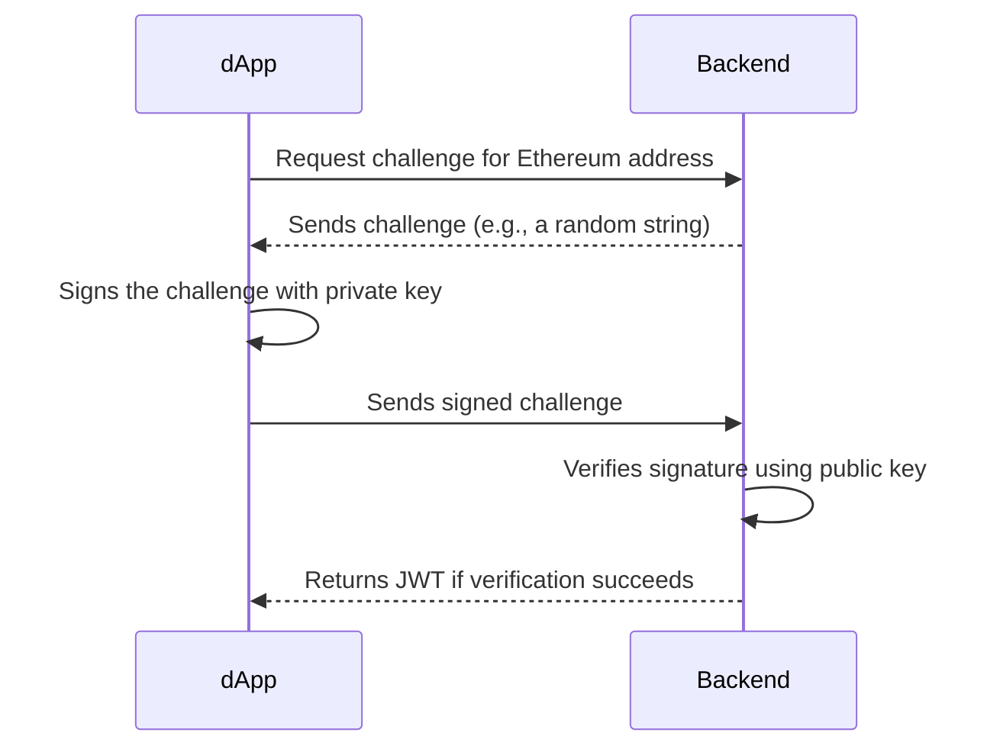

# Building Secure Web3 to Web2 connections

## Overview


```mermaid
sequenceDiagram
    participant dApp
    participant Backend

    dApp->>Backend: Request challenge for Ethereum address
    Backend-->>dApp: Sends challenge (e.g., a random string)
    dApp->>dApp: Signs the challenge with private key
    dApp->>Backend: Sends signed challenge
    Backend->>Backend: Verifies signature using public key
    Backend-->>dApp: Returns JWT if verification succeeds
```

## Setup

```sh
pnpm i
```

## Run

### Backend

```sh
pnpm run backend:dev
```

### Dapp

```sh
pnpm run dapp:dev
```
